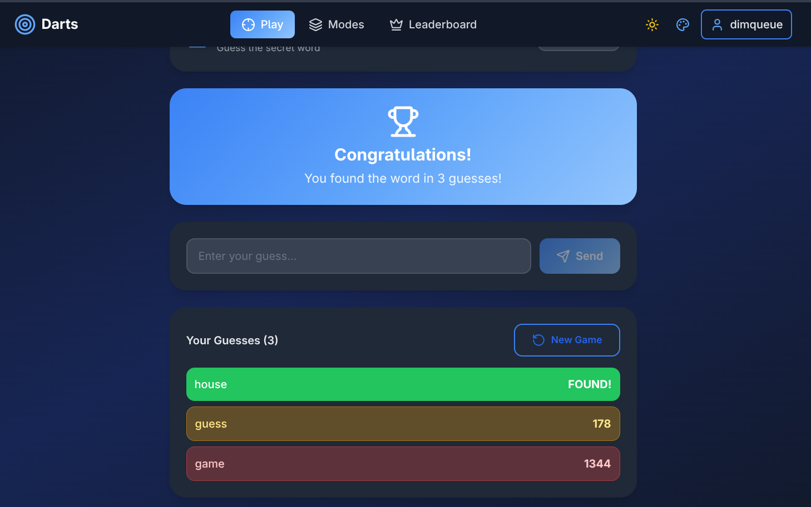
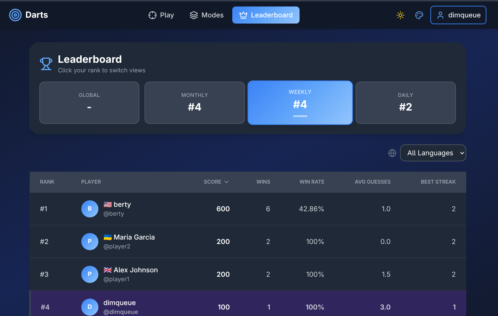
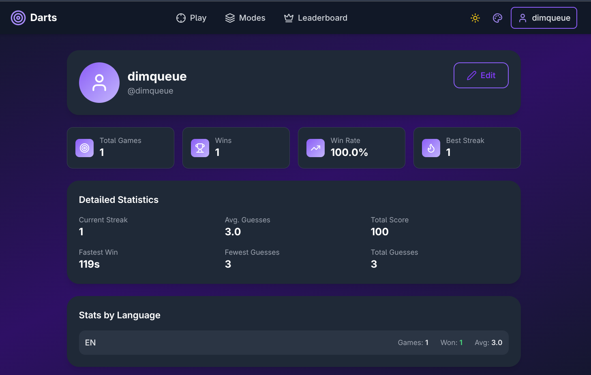

# Darts

A full-stack word similarity guessing game inspired by [Contexto](https://contexto.me/). Players try to guess a secret word and receive semantic distance feedback powered by machine learning word embeddings.

[](https://go.dev/)
[](https://react.dev/)
[](https://python.org/)
[](https://docker.com/)
[](LICENSE)

## Demo

**Live Demo:** https://dimqueue.github.io/darts/ (mock API mode)

> Note: The demo uses mock data. Full version requires the backend services.

## Screenshots

<p align="center">
  
</p>

<p align="center">
  
</p>

<p align="center">
  
</p>

## Features

- Word similarity game with semantic distance feedback
- Multiple languages (English, Ukrainian)
- Leaderboards (global, monthly, weekly, daily)
- User profiles and statistics
- Dark/light mode with multiple color themes
- Redis caching for leaderboards
- Swagger API documentation
- Mock API mode for frontend-only development

## Tech Stack

### Backend
- **Go 1.24** + Gin 1.10 (web framework)
- **PostgreSQL 16** + sqlx + lib/pq
- JWT authentication (golang-jwt)
- Argon2 password hashing
- sql-migrate for migrations
- Viper for configuration
- Logrus for structured logging
- Swagger/OpenAPI (swaggo)
- gRPC client + Protobuf

### ML/Compute Service
- **Python 3.11**
- **FastAPI 0.104** + Uvicorn (async HTTP)
- **Pydantic 2.5** (data validation)
- gRPC server + Protobuf
- **Gensim 4.3** (Word2Vec, GloVe embeddings)
- **Redis 7** (game rankings cache)
- NumPy 1.24 + SciPy 1.10
- psutil (resource monitoring)

### Frontend
- **React 19.2** + React Router DOM 6.30
- **Vite 7.2** (fast HMR, optimized builds)
- **Tailwind CSS 3.4** (utility-first styling)
- Lucide React (icons)
- Context API for state management
- ESLint 9 + PostCSS

### Infrastructure
- Docker & Docker Compose
- Multi-stage Docker builds
- nginx Alpine (gzip, caching, SPA routing)
- PostgreSQL 16 Alpine
- Buf (proto management with remote plugins)

## Architecture

```
+-------------+      HTTP      +-------------+      gRPC      +-------------+
|  Frontend   |<-------------->|   Backend   |<-------------->|   Compute   |
|   (React)   |     :3000      |    (Go)     |    :50051      |  (Python)   |
+-------------+                +------+------+                +------+------+
                                      |                           |      |
                                      v                           v      v
                               +-------------+             +-------+  +-------+
                               | PostgreSQL  |             | Redis |  |Gensim |
                               |    :5432    |             | :6379 |  |Models |
                               +-------------+             +-------+  +-------+
```

**Architecture Highlights:**
- Microservices architecture (2 independent services)
- gRPC for high-performance backend-ML communication
- REST API for frontend
- Runtime environment injection (Docker)
- Multiple deployment modes

## Quick Start

### Docker (Recommended)

**Linux / macOS:**
```bash
git clone https://github.com/dimqueue/darts.git
cd darts
cp .env.example .env
docker-compose up --build
```

**Access:**
- Frontend: http://localhost:3000
- Backend API: http://localhost:8080
- Swagger Docs: http://localhost:8080/swagger/index.html

## Prerequisites

### Docker (Easiest)

| OS | Requirements |
|----|--------------|
| Linux | Docker, Docker Compose |
| macOS | Docker Desktop |
| Windows | Docker Desktop (WSL2 backend) |

### Local Development

| Component | Version | Purpose |
|-----------|---------|---------|
| Go | 1.24+ | Backend |
| Node.js | 20+ | Frontend |
| Python | 3.10+ | Compute service |
| PostgreSQL | 16 | Database |

### Optional (for proto changes only)

| Tool | Purpose |
|------|---------|
| [Buf CLI](https://buf.build/docs/installation) | Regenerate proto files (`make proto`) |

> Buf uses remote plugins from buf.build - no local protoc installation needed.

## Deployment Modes

| Mode | Command | API | Use Case |
|------|---------|-----|----------|
| Docker | `docker-compose up` | Real | Full stack development |
| Local dev | `npm run dev` | Real (proxy) | Frontend with local backend |
| Mock mode | `npm run dev:mock` | Mock | Frontend only, no backend |
| GitHub Pages | `npm run build:pages` | Mock | Static demo deployment |

## Project Structure

```
darts/
|-- frontend/           # React SPA (Vite + Tailwind)
|-- backend/            # Go REST API (Gin)
|-- compute-client/     # Python ML service (FastAPI + gRPC)
|-- proto/              # Protocol Buffer definitions
|-- docker-compose.yml  # Container orchestration
|-- Makefile            # Proto generation commands
```

## Commands

```bash
# Start all services
docker-compose up --build

# Load sample data (first time)
docker-compose exec backend darts seed

# Run migrations
docker-compose exec backend darts migrates-up
docker-compose exec backend darts migrates-down

# View logs
docker-compose logs -f backend
docker-compose logs -f compute-client

# Reset database
docker-compose down -v
docker-compose up --build

# Regenerate proto files (requires buf CLI)
make proto
```

## Local Development (without Docker)

**Terminal 1 - Database:**
```bash
docker run -d --name dartsdb \
  -e POSTGRES_USER=admin \
  -e POSTGRES_PASSWORD=players \
  -e POSTGRES_DB=dartsdb \
  -p 5432:5432 \
  postgres:16-alpine
```

**Terminal 2 - Compute Client:**
```bash
cd compute-client
python -m venv venv
source venv/bin/activate  # Windows: venv\Scripts\activate
pip install -r requirements.txt
python -m src.main
```

**Terminal 3 - Backend:**
```bash
cd backend
go run cmd/app/main.go migrates-up
go run cmd/app/main.go run-server

go run -tags dev cmd/app/main.go migrates-up
go run -tags dev cmd/app/main.go run-server
```

**Terminal 4 - Frontend:**
```bash
cd frontend
npm install
npm run dev
```

## API Documentation

Swagger UI is available at http://localhost:8080/swagger/index.html when the backend is running.

## Roadmap

###  Deployment & Infrastructure
- [ ] Google Cloud deployment (Cloud Run / GKE)
- [ ] CI/CD pipeline (GitHub Actions)
- [ ] CDN for static assets
- [x] Redis caching layer (game rankings)
- [ ] Error monitoring (Sentry)
- [ ] Rate limiting & API throttling

###  ML & Word Embeddings
- [ ] Train custom Ukrainian word2vec model on UA corpus
- [ ] Train custom English model for better game experience
- [ ] Upgrade to word2vec-google-news-300 (or custom-trained)
- [ ] Word difficulty classification using frequency analysis
- [ ] Improved hint system (semantic clusters, categories)
- [ ] Model versioning & A/B testing infrastructure

###  Languages & Localization
- [ ] Spanish, French, German
- [ ] Custom vocabulary sets per language
- [ ] UI localization (i18n)

###  Multiplayer & Social
- [ ] Real-time PvP mode (WebSocket/SSE)
- [ ] Friend system & challenges
- [ ] Cooperative mode (team guessing)
- [ ] Tournaments / competitive seasons
- [ ] Share results to social media
- [ ] Spectator mode

###  Gamification
- [ ] Daily challenges with rewards
- [ ] Achievement system / badges
- [ ] XP and player levels
- [ ] Seasonal events & limited-time modes
- [ ] Streak bonuses & rewards

###  UX/UI Improvements
- [ ] Animations and transitions
- [ ] Keyboard shortcuts
- [ ] Sound effects & audio feedback
- [ ] Accessibility improvements (a11y)
- [ ] Mobile app (React Native / PWA)
- [x] Dark/light mode with theme switcher

###  Analytics & Insights
- [ ] Player statistics dashboard
- [ ] Word difficulty analytics
- [ ] Admin dashboard for word management
## License

MIT License - see [LICENSE](LICENSE) for details.
